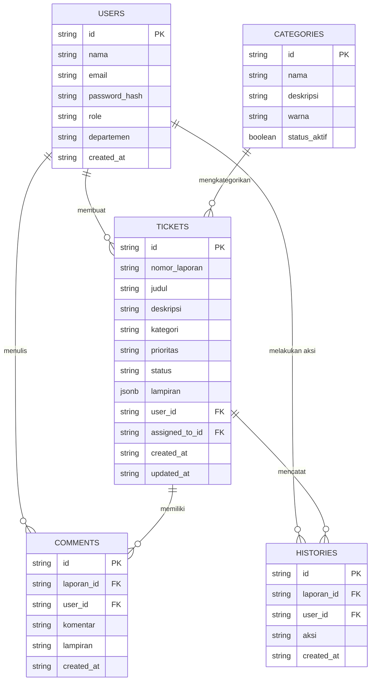

# Product Requirement Document (PRD)
## Sistem Laporan Kendala IT (IT Helpdesk Management System)

---

## 1. Informasi Dokumen
| Informasi | Detail |
| :--- | :--- |
| **Nama Produk** | Sistem Laporan Kendala IT (IT Helpdesk System) |
| **Versi Dokumen** | 1.0.0 (FINAL) |
| **Status** | Approved / Production-Ready |
| **Teknologi Utama** | Vue 3, TypeScript, Vite, Express.js, Pinia, Drizzle ORM / JSON Store |
| **Pemilik Produk** | Tim IT Development |

---

## 2. Ringkasan Eksekutif (Executive Summary)
**Sistem Laporan Kendala IT** adalah aplikasi web manajemen tiket (*helpdesk ticket management system*) yang dirancang untuk memfasilitasi pelaporan, penanganan, pemantauan, dan resolusi kendala infrastruktur IT di lingkungan perusahaan. 

Aplikasi ini menghubungkan karyawan (*Employee*) dengan Tim Penanggung Jawab IT (*Admin/IT Support*), menyajikan transparansi penanganan masalah secara real-time, mempercepat alur kerja dukungan teknis, dan menyediakan analitik komprehensif terkait kesehatan fasilitas IT perusahaan.

---

## 3. Latar Belakang & Masalah (Background & Problem Statement)

### Latar Belakang
Sebelumnya, pencatatan kendala IT sering kali dilakukan secara manual atau melalui aplikasi pesan instan yang tidak terstruktur. Hal ini menyebabkan penanganan kendala yang tidak terlacak, risiko lupa menangani laporan, serta ketiadaan statistik mengenai perangkat atau layanan IT yang paling sering bermasalah.

### Masalah Utama yang Diselesaikan
1. **Tidak Ada Pelacakan Riwayat (Lack of Audit Trail)**: Pelapor tidak tahu sejauh mana laporan mereka telah diproses oleh tim IT.
2. **Penumpukan dan Kerancuan Prioritas**: Tim IT kesulitan menyaring mana kendala kritis (*sistem down*) dan kendala minor (*pertanyaan umum*).
3. **Keterbatasan Media Komunikasi**: Ketidakmampuan melampirkan screenshot pesan error atau bukti fisik secara cepat dan efisien.
4. **Kurangnya Data Analitik**: Manajemen IT tidak memiliki visualisasi data terkait tren kendala bulanan, efisiensi penyelesaian kendala, dan beban kerja tim IT.

---

## 4. Target Pengguna & Peran Sistem (User Personas & RBAC)

Sistem ini menerapkan **Role-Based Access Control (RBAC)** dengan dua tingkatan peran utama:

| Peran Pengguna | Deskripsi & Hak Akses |
| :--- | :--- |
| **Employee (Karyawan)** | • Membuat laporan kendala baru dengan deskripsi dan lampiran foto. • Memantau status penanganan laporan milik sendiri. • Menambahkan komentar/balasan pada diskusi laporan. • Mengedit laporan milik sendiri jika status masih `Baru`. |
| **Admin / IT Support** | • Mengakses seluruh laporan dari semua departemen. • Memperbarui status laporan (`Baru` ➔ `Sedang Diproses` ➔ `Menunggu Konfirmasi` ➔ `Selesai` ➔ `Ditutup`). • Mengatur prioritas laporan (`Rendah`, `Sedang`, `Tinggi`, `Kritis`). • Menetapkan penanggung jawab (*Assignee*) untuk setiap tiket. • Mengelola data Pengguna (*Users CRUD*) dan Kategori Kendala (*Categories CRUD*). • Mengakses Dashboard Analitik & Statistik performa IT Helpdesk. |

---

## 5. Arsitektur Sistem & Teknologi (Tech Stack)

### Front-End
- **Framework**: Vue 3 (Composition API dengan `<script setup lang="ts">`)
- **State Management**: Pinia (Store untuk `auth` & `tickets`)
- **Routing**: Vue Router dengan Navigation Guards & Session Guards
- **Styling**: Vanilla CSS + TailwindCSS dengan Desain Dark Mode & Glassmorphism Aesthetics
- **Iconography**: Lucide Vue Next
- **Client Compression**: HTML5 Canvas Image Compression Utility (`src/utils/image.ts`)

### Back-End
- **Server Engine**: Node.js dengan Express.js (TypeScript)
- **Autentikasi**: JSON Web Token (JWT) & Bcrypt password hashing
- **Middleware**: Express CORS, JSON Body Parser (limit up to 50MB)

### Database Layer (Hybrid Strategy)
- **Primary Database**: PostgreSQL dengan Drizzle ORM
- **Fallback Database**: Automatic JSON File Storage (`data_store.json`) apabila koneksi PostgreSQL tidak tersedia. Menjamin keberlanjutan aplikasi (*Zero Downtime Fallback*).

---

## 6. Spesifikasi Fitur Utama (Functional Requirements)

### A. Autentikasi & Keamanan Sesi
- **Login Sesi Terisolasi**: Sesi login disimpan di `sessionStorage`. Saat tab atau browser ditutup, sesi otomatis berakhir demi keamanan data perusahaan.
- **Enkripsi Kata Sandi**: Setiap password di-hash menggunakan `bcryptjs` sebelum disimpan ke database.
- **Proteksi Rute (Route Guards)**: Rute administratif (`/users`, `/categories`) dilindungi guard `meta: { roles: ['admin'] }`.

### B. Manajemen Laporan Kendala (Tickets Management)
- **Formulir Buat Tiket**:
  - Judul kendala, Kategori (Hardware, Software, Network, Printer, Email, Account), Prioritas, dan Deskripsi lengkap.
  - Generasi Otomatis Kode Laporan (*Nomor Tiket*), contoh: `TKT-202607-001`.
- **Daftar Tiket & Filter Cerdas**:
  - Pencarian kata kunci pada Judul, Nomor Tiket, Deskripsi, atau Nama Pelapor.
  - Filter kombinasi beradasarkan Status, Kategori, dan Prioritas.
- **Rincian Tiket & Audit Log**:
  - Timeline Riwayat Audit Log otomatis mencatat setiap perubahan status, pengubahan prioritas, penetapan penanggung jawab, hingga waktu resolusi tiket.

### C. Sistem Lampiran & Kompresi Gambar
- **Kompresi Klien Otomatis**: Gambar yang diunggah pengguna (hingga 10MB) otomatis dikompresi di sisi browser menggunakan Canvas HTML5 menjadi format JPEG (maksimal 1600px width/height, kualitas 80%). Ini menghemat konsumsi bandwidth hingga 90%.
- **Interactive Lightbox Modal**: Klik pada thumbnail lampiran di deskripsi atau komentar akan menampilkan modal gambar interaktif layar penuh (*fullscreen zoom*), menghindari pemblokiran browser pada *data URL*.

### D. Thread Komentar & Diskusi
- Kolom diskusi dua arah antara Pelapor dan Tim IT Support.
- Setiap komentar mendukung lampiran foto screenshot bukti fisik tambahan.
- Label peran pengguna (*Badge Admin / Employee*) pada komentar.

### E. Dashboard Analitik & Statistik
- **Ringkasan Kartu Metrik**: Total Laporan, Laporan Baru, Sedang Diproses, Menunggu Konfirmasi, Selesai, dan Ditutup.
- **Visualisasi Berdasarkan Kategori & Prioritas**: Rekapitulasi kendala terbanyak yang dihadapi departemen.
- **Daftar Laporan Terbaru**: Akses cepat ke 5 laporan kendala paling akhir.

### F. Manajemen Pengguna & Kategori (Admin Only)
- **Pengelolaan User**: Tambah, edit, ubah peran (*Role*), dan hapus akun pengguna.
- **Pengelolaan Kategori**: Tambah/edit kategori kendala lengkap dengan deskripsi dan identifikasi warna tag.

---

## 7. Skema Data (Database Schema)

---

## 8. Kebutuhan Non-Fungsional (Non-Functional Requirements)

1. **Performansi (Performance)**:
   - Waktu muat halaman pertama (*First Contentful Paint*) < 1.5 detik.
   - Ukuran payload upload gambar terkompresi < 300 KB per file.
2. **Estetika & Antarmuka (UI/UX Aesthetics)**:
   - Tema *Dark Mode Modern* dengan kontras tinggi (Latar belakang slate gelap, elemen kaca *glassmorphic*, dan pencahayaan aksen cyan/sky/emerald).
   - Tipografi modern dan transisi animasi mikro yang halus (*smooth micro-animations*).
3. **Keandalan & Resiliensi (Reliability)**:
   - Apabila koneksi database utama (PostgreSQL) mengalami gangguan, sistem secara otomatis beralih ke penyimpanan lokal `data_store.json` tanpa menghentikan layanan.
4. **Responsivitas Perangkat**:
   - Layout responsif 100% pada tampilan Ponsel (*Mobile*), Tablet, maupun Komputer Desktop.

---

## 9. Rencana Verifikasi & Pengujian

- **Pengujian Autentikasi**: Memastikan user tanpa token di-redirect ke halaman Login dan sesi terhapus saat tab ditutup.
- **Pengujian Kompresi Upload**: Memastikan foto resolusi tinggi (misal 8MB) berhasil dikompresi menjadi < 300KB dan dapat ditampilkan sempurna pada Lightbox Modal.
- **Pengujian RBAC**: Memastikan akun peran `Employee` tidak dapat mengakses menu `/users` dan `/categories`.
- **Pengujian Alur Tiket**: Pengujian pembuatan tiket hingga penyelesaian oleh Admin dan pencatatan audit log.

---
*Dokumen ini dibuat secara otomatis sebagai pedoman standar pengembangan dan dokumentasi proyek Sistem Laporan Kendala IT.*
